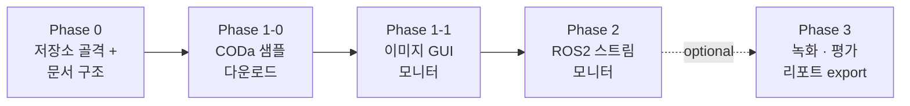

# SCVTerraScope — Object Detection 추론 모니터링 도구

## Context

SCVTerraVision 학습 프로젝트(`/home/soobin/development/SCVTerraVision`)에서 DINOv3 ViT-B/16 백본 + HF DeformableDETR 헤드 기반 16-class object detection 모델 학습이 Phase 1-2b 까지 완료되었다 (`epoch_050.pt` 베이스라인 mAP=0.623, AP50=0.925). 이제 **학습된 인퍼런스 모델을 실제로 가시화·검증**하기 위한 별도 모니터링 도구가 필요하다. 본 저장소(SCVTerraScope)는 LICENSE 만 있는 그린필드이며, 학습 파이프라인과 추론 GUI 의 관심사를 분리하기 위해 의도적으로 별도 저장소로 둔다.

전체 작업은 두 단계로 진행한다 — **Phase 1**: 정지 이미지/폴더 단위 PyQt6 GUI 모니터링 → **Phase 2**: ROS 2 토픽 영상 스트림 실시간 모니터링. 사용자는 각 단계 완료 시점마다 다음 단계를 별도로 재계획할 것을 요청했다.

## 결정 사항 (2026-04-26)

| 항목 | 선택 | 비고 |
|---|---|---|
| GUI 프레임워크 | PyQt6 | Phase 2 영상/ROS 통합까지 동일 스택 |
| 모델 의존성 | `pip install -e ../SCVTerraVision` (editable) | 학습측 코드 변경 자동 반영 |
| ROS 버전 (Phase 2) | ROS 2 | Humble/Jazzy 가정, 세부는 Phase 2 시점에 확정 |
| Phase 1 입력 범위 | 단일 이미지 + 폴더 일괄 | 비디오/스트림은 Phase 2 |
| 검증 데이터 출처 | **CODa tiny split (ut-amrl/coda-devkit)** | SCVTerraScope dev 머신에서 marsberry 계정 데이터 접근 불가 → 별도 다운로드 필요 |
| 문서 양식 | SCVTerraVision `docs/` 구조를 그대로 미러링 | PLAN · progress 대시보드 · ADR · runbook |

## 전체 로드맵



원래 단일 단계였던 "Phase 1 이미지 GUI" 를 두 개로 쪼갰다 — Phase 1-1 (GUI 코드) 가 의미 있게 동작하려면 실 입력 이미지가 필요한데, 현재 dev 머신에서는 CODa 데이터가 sibling 사용자(`/home/marsberry/`) 에 있어 접근 불가하기 때문이다. Phase 1-0 에서 공식 CODa tiny split 을 SCVTerraScope 자체 디렉토리로 가져와 두 단계를 분리한다.

각 Phase 의 하위 작업·체크리스트·검증 결과는 `docs/progress/phase*.md` 에 단계별로 작성하며, 사용자 승인 게이트를 거친 뒤에야 다음 단계 파일을 생성한다 (SCVTerraVision 동일 규칙).

---

## Phase 0 — 저장소 골격 및 문서 구조

저장소가 비어 있으므로 본격 코드 작성 전에 골격을 깐다.

**디렉토리 구조 (생성 대상)**
```
SCVTerraScope/
├─ pyproject.toml                  # 패키지 메타 + 의존성 (PyQt6, pyyaml, pillow, numpy, opencv-python)
├─ README.md                       # 짧은 소개 + 설치/실행
├─ .gitignore                      # Python · Qt · venv · outputs
├─ .pre-commit-config.yaml         # ruff + black (SCVTerraVision 동일)
├─ pytest.ini
├─ src/scvterrascope/              # src-layout 패키지
│   ├─ __init__.py
│   ├─ inference/                  # Phase 1 핵심
│   ├─ visualization/              # Phase 1 핵심
│   ├─ gui/                        # Phase 1 핵심
│   └─ labels.py
├─ scripts/
│   └─ launch_monitor.py           # GUI 실행 엔트리
├─ configs/
│   └─ default.yaml                # 기본 ckpt 경로 · 클래스 색상 · 임계값
├─ tests/
├─ docs/
│   ├─ PLAN.md                     # 본 플랜의 in-repo 사본
│   ├─ progress/
│   │   ├─ README.md               # 단계 대시보드 (✅/🟢/⏳/⚪)
│   │   └─ phase0.md               # 본 단계 상세
│   ├─ decisions/                  # ADR (작성 예정)
│   │   └─ 20260426_gui-framework-pyqt6.md
│   └─ runbooks/                   # 실행 가이드 (Phase 1 완료 후 작성)
└─ outputs/                        # 사용자 export 결과 (gitignore)
```

**Phase 0 산출물**: 위 골격 + `pyproject.toml` (Python ≥3.10) + ADR 1개 (PyQt6 채택) + `docs/PLAN.md` + `docs/progress/README.md` + `docs/progress/phase0.md`. 코드는 빈 `__init__.py` 외 미작성.

---

## Phase 1-0 — 검증 데이터 샘플 확보

### 목표

CODa devkit (`github.com/ut-amrl/coda-devkit`) 의 공식 다운로드 도구로 **tiny split** 을 SCVTerraScope 의 `data/` 하위에 가져와 Phase 1-1 GUI 검증의 입력으로 사용한다. SCVTerraScope dev 머신에서는 SCVTerraVision 학습 시 사용한 `/home/marsberry/dataset/coda-devkit/data/CODa_full` 가 다른 사용자 계정에 있어 접근 불가하므로, 본 단계가 Phase 1-1 GUI 데모/검증의 사실상 prerequisite 가 된다.

### CODa 데이터 정보 (조사 결과 요약)

- **공식 저장소**: `https://github.com/ut-amrl/coda-devkit`
- **공식 데이터 호스팅**: Texas Data Repository — `https://dataverse.tdl.org/dataset.xhtml?persistentId=doi:10.18738/T8/BBOQMV`
- **다운로드 도구**: `coda-devkit/scripts/download_split.py`
  - `python scripts/download_split.py -d ./data -t split -sp tiny` — tiny split (사이즈 미공개, 가장 작음)
  - `python scripts/download_split.py -d ./data -t sequence -se 0` — 단일 시퀀스 (~17GB)
  - `python scripts/download_split.py -d ./data -t split -sp full` — 전체 (~1.5TB, 비권장)
- **이미지 디스크 레이아웃** (다운로드 후): `2d_rect/{cam0|cam1}/{SEQUENCE}/2d_rect_{cam0|cam1}_{SEQUENCE}_{FRAME}.jpg` (1224×1024, JPG).
- **3D bbox**: `3d_bbox/os1/3d_bbox_os1_{SEQUENCE}_{FRAME}.json` (Phase 1-1 시각화에는 미사용, ground-truth 비교 시 활용 가능).
- **시퀀스**: 22개 (0–21).
- **클래스**: 16-class operational taxonomy (SCVTerraVision `configs/dataset/coda_taxonomy.yaml` 와 동일).
- **주의**: SCVTerraVision 의 `coda_validation_coco.json` 은 파일명이 `*.png` 로 표기되지만 CODa 원본은 `.jpg`. 학습 측 converter (`SCVTerraVision/training/datasets/coda_to_coco.py`) 가 변환을 가정하므로, GT 정합 검증 시 SCVTerraVision 변환 파이프라인을 통과시켜야 함. **GUI 단순 추론 데모만 한다면 JPG 그대로도 동작** (Pillow 가 확장자 무관 로드).

### 산출물

- `scripts/fetch_coda_samples.py` — `coda-devkit` 클론 + `download_split.py` 호출을 자동화하는 얇은 래퍼.
  - 옵션: `--split {tiny,small,medium,full}` (기본 tiny), `--sequence N` (시퀀스 지정 시 split 옵션 무시), `--dest data/coda_samples/`, `--coda-devkit-dir <path>` (기존 클론 재사용용).
  - 의존성: 표준 라이브러리만 사용 (subprocess + argparse). coda-devkit 자체 의존성은 그쪽 environment.yml 사용.
- `docs/runbooks/data_setup.md` — 사용자가 직접 실행할 절차.
  - 디스크 공간·시간 안내, tiny vs sequence 선택 가이드, 다운로드 후 SCVTerraScope `configs/default.yaml` 의 `samples_dir` 설정 방법, 실패 시 폴백 (소량 수동 다운로드).
- `data/coda_samples/` 디렉토리 (gitignore'd, `.gitkeep` 만 커밋).
- `configs/default.yaml` 에 `samples_dir` 추가.
- `.gitignore` 에 `data/` 규칙 추가 (annotation JSON 등 의도치 않은 커밋 방지).

### 체크리스트

- [ ] `.gitignore` 에 `data/coda_samples/`, `data/coda-devkit/` 추가
- [ ] `data/coda_samples/.gitkeep`, `data/coda-devkit/.gitkeep` 생성
- [ ] `configs/default.yaml` 에 `samples_dir: data/coda_samples` 추가
- [ ] `scripts/fetch_coda_samples.py` 작성 + `python scripts/fetch_coda_samples.py --help` 동작 확인
- [ ] `docs/runbooks/data_setup.md` 작성
- [ ] `docs/progress/phase1-0_data_samples.md` 작성 + 대시보드 갱신
- [ ] **(사용자 실행)** `python scripts/fetch_coda_samples.py --split tiny` 로 실제 다운로드 → 결과 디렉토리 트리 확인 → 본 progress 의 검증 로그에 append

### 검증 방법

1. `--help` 동작 → argparse 에러 없음.
2. `--dry-run` 옵션 (구현 시) 으로 실행 시 실제 다운로드 없이 명령만 출력.
3. 사용자가 `--split tiny` 실 다운로드 → `data/coda_samples/2d_rect/cam0/<SEQ>/` 하위에 적어도 한 시퀀스 이상 이미지가 존재하는지 확인.
4. 다운로드된 이미지 1장을 PIL 로 열어 1224×1024 RGB 디코딩 정상 확인.

### 결정 / 미정

- **tiny split 사이즈**가 coda-devkit 문서에 미공개 → 1회 사용자 다운로드 후 본 progress 문서에 실측치 기록 + 필요 시 ADR 추가.
- coda-devkit 의 conda 환경(Python 3.8–3.9 권장)이 SCVTerraScope (Python 3.10+) 와 충돌 가능 — 별도 conda env 권장. 다운로드 후 SCVTerraScope 측은 이미지만 사용하므로 환경 분리 가능.

---

## Phase 1-1 — 이미지 GUI 모니터링 (상세 설계)

### 목표

학습 체크포인트(`SCVTerraVision/outputs/checkpoints/dinov3_detr_base_full/epoch_050.pt`)를 로드해, 사용자가 GUI 에서 (a) 단일 이미지 또는 (b) 폴더를 열면 각 이미지에 대해 DINOv3+DETR 추론을 돌리고 bbox · class · confidence 를 시각화한다.

### 핵심 모듈

#### 1. `src/scvterrascope/inference/engine.py`
SCVTerraVision 의 추론 패턴을 그대로 재사용한다 — `scripts/eval_detection.py` 의 `build_model()` · `load_checkpoint()` · `run_inference()` 가 레퍼런스.

- `class InferenceEngine`
  - `__init__(checkpoint_path, device="auto", image_size=1024, score_threshold=0.3, top_k=100)`
  - `load()` → 내부에서 `from models.detection.detr_head import DinoV3DeformableDetr` (editable install 로 import 가능). HF_TOKEN 미설정 시 명확한 에러.
  - `predict(pil_image: PIL.Image) -> list[Detection]` — 단일 이미지에 대해 letterbox preprocess → forward → `DeformableDetrImageProcessor.post_process_object_detection` → letterbox 역변환 (eval_detection.py:104-129 동일 로직). 반환은 원본 좌표계 xyxy.
- `@dataclass Detection`: `class_id: int`, `class_name: str`, `score: float`, `bbox_xyxy: tuple[float,float,float,float]`

#### 2. `src/scvterrascope/inference/preprocess.py`
- `letterbox_resize(image, target_size=1024)` — SCVTerraVision `training/train_detection.py` 의 letterbox 와 **반드시 동일한 scale/padding 규칙** 사용 (그렇지 않으면 좌표 역변환이 어긋난다). 가능하면 SCVTerraVision 의 함수를 직접 import 하여 중복을 피한다.
- ImageNet 정규화 (mean=(0.485, 0.456, 0.406), std=(0.229, 0.224, 0.225)).

#### 3. `src/scvterrascope/labels.py`
SCVTerraVision `configs/dataset/coda_taxonomy.yaml` 의 `operational_classes` 16개를 로드. 우선은 editable install 경로에서 PyYAML 로 읽고, 향후 분리가 필요하면 사본을 두는 ADR 추가.

#### 4. `src/scvterrascope/visualization/draw.py`
- `draw_detections(pil_image, detections, palette) -> PIL.Image` — bbox + 클래스명 + 점수 라벨. 클래스별 고정 컬러 팔레트 (16색 HSV 등분).
- 폰트는 시스템 기본 + Pillow `ImageDraw.text`.

#### 5. `src/scvterrascope/gui/` — PyQt6 애플리케이션
- `main_window.py` `QMainWindow`
  - 메뉴: File (Open Image, Open Folder, Export Result, Quit), View (Toggle table), Help
  - 상태바: 추론 시간, 현재 device (CUDA/CPU), checkpoint 파일명
- `widgets/control_panel.py` (왼쪽 도크)
  - Checkpoint 선택 (`QFileDialog`, 기본값은 configs/default.yaml)
  - Score threshold 슬라이더 (0.0–1.0, 기본 0.3) — 변경 시 즉시 재렌더 (재추론 X, 캐시된 결과 필터)
  - Top-K spinbox (10–300, 기본 100)
  - Class 멀티 토글 (16개 체크박스)
  - "Run inference" 버튼 + 진행률 바
- `widgets/file_list.py` (왼쪽 하단, 폴더 모드일 때) — 썸네일 리스트, 클릭 시 메인 캔버스 갱신
- `widgets/image_canvas.py` (중앙) — `QGraphicsView`/`QGraphicsScene` 기반, 휠 줌·드래그 팬, bbox 오버레이는 결과 변경 시만 갱신
- `widgets/results_table.py` (하단 도크) — class · score · bbox · 행 클릭 시 캔버스에서 해당 박스 하이라이트
- **추론 스레드**: GUI freeze 방지를 위해 `QThread` 또는 `QThreadPool` 위에서 `InferenceEngine.predict` 실행. 폴더 모드는 큐 기반 순차 처리 + 진행률.

#### 6. `scripts/launch_monitor.py`
- `python -m scvterrascope.gui` 와 동등한 엔트리포인트. argparse 로 `--checkpoint`, `--device`, `--config` 옵션 노출.

### 재사용할 SCVTerraVision 자산 (수정 금지)
| 파일 | 용도 |
|---|---|
| `models/detection/detr_head.py` | `DinoV3DeformableDetr` 모델 빌더 |
| `models/backbone/dinov3_backbone.py` | DINOv3 백본 (DinoV3DeformableDetr 가 내부 사용) |
| `scripts/eval_detection.py` | letterbox 좌표 역변환 · 후처리 레퍼런스 코드 |
| `training/train_detection.py` | letterbox preprocess 함수 (가능하면 직접 import) |
| `configs/dataset/coda_taxonomy.yaml` | 16-class 라벨 |

### Phase 1-1 산출물
- `src/scvterrascope/{inference,visualization,gui,labels.py}` 전체
- `scripts/launch_monitor.py`
- `configs/default.yaml` (Phase 1-0 에서 `samples_dir` 추가됨, 본 단계에서 `checkpoint_path` 등 주석 갱신)
- `tests/test_inference_engine.py` (mocked 체크포인트 또는 `RUN_GPU_SMOKE=1` gated 실모델 1회 forward)
- `tests/test_visualization.py` (draw 함수 픽셀 비교)
- `docs/progress/phase1-1_image_monitor.md` (체크리스트 + 검증 로그)
- `docs/runbooks/phase1-1_launch.md` (HF_TOKEN, 체크포인트 경로 설정 방법)

### Phase 1-1 검증 방법
1. **단위**: `pytest -q` — gated 제외 전부 green.
2. **임포트 스모크**: `python -c "from scvterrascope.inference import InferenceEngine"` 의존성 정상 로드.
3. **실모델 스모크** (GPU 환경, `HF_TOKEN` 설정): `python scripts/launch_monitor.py --checkpoint .../epoch_050.pt` → Phase 1-0 에서 다운받은 `data/coda_samples/2d_rect/cam0/<SEQ>/` 의 이미지 1장을 GUI 에서 열어 bbox 가 그려지고 score/class 가 표시되는지 사용자 육안 확인.
4. **폴더 모드**: `data/coda_samples/2d_rect/cam0/<SEQ>/` 통째로 선택 시 진행률 + 썸네일 네비 동작.
5. **임계값 슬라이더**: 추론 결과 변경 없이 표시 박스 수가 바뀌는지 확인 (재추론 트리거 X).
6. **GPU 미장착 환경 폴백**: `--device cpu` 로 실행 가능, 단 추론 시간 표시.

---

## Phase 2 — ROS 2 스트림 모니터링 (스케치, 본격 계획은 Phase 1 완료 후)

Phase 1 의 `InferenceEngine` 과 `widgets/image_canvas.py` 를 그대로 재사용하고, 입력단에 ROS 2 노드를 추가한다. 현시점 가설:

- `rclpy` + `cv_bridge` 로 `sensor_msgs/Image` 토픽 구독 → numpy → PIL → `InferenceEngine.predict`.
- PyQt 메인스레드와 rclpy spin 을 별도 `QThread` 에서 돌리고, `pyqtSignal` 로 frame 전달.
- 토픽 선택 UI, FPS 표시, 다운샘플링/스킵 옵션, 녹화 토글.
- ROS 2 배포판/카메라 토픽 스펙·하드웨어 환경은 Phase 1 종료 시점에 확정 후 별도 `phase2_ros2_stream.md` 에 상세 기록.

이 단계 진입 전, Phase 1 의 모듈이 영상 입력 (≥10 FPS) 을 무리 없이 처리하는지 측정해 병목을 식별한다 (필요 시 ONNX/TensorRT export 분기 ADR 작성).

---

## 문서 작성 규칙 (SCVTerraVision 미러)

- `docs/PLAN.md` — 본 플랜 사본 (승인 후 갱신).
- `docs/progress/README.md` — 단계 대시보드. 상태 범례 ⏳/✅/🟢/⛔/⚪ 동일.
- `docs/progress/phase{0,1,2}_*.md` — 각 단계의 목표 · 결정사항 · 체크리스트 · 산출물 · 검증 로그 · 사용자 검토 결과 섹션 포함. 한국어 본문, 코드/식별자/CLI 는 영문.
- `docs/decisions/YYYYMMDD_<topic>.md` — 비가역적 기술 결정만 ADR. 첫 ADR 후보: `20260426_gui-framework-pyqt6.md`, `20260426_consume-terravision-editable.md`.
- `docs/runbooks/` — 사용자가 직접 실행하는 절차 (HF_TOKEN, 체크포인트 다운로드, GPU 환경 셋업).

---

## 진행 절차 (사용자 승인 게이트)

1. 본 플랜 승인 → Phase 0 골격 PR. (✅ 완료 2026-04-26)
2. Phase 0 승인 → **Phase 1-0 (데이터 샘플 확보)** 착수: 스크립트·runbook·progress 작성 + 사용자 실행으로 tiny split 다운로드.
3. Phase 1-0 승인 → Phase 1-1 (GUI) 작업 시작, 진행 중 `phase1-1_image_monitor.md` 갱신.
4. Phase 1-1 코드 + GUI 스모크 데모 → 사용자 육안 검토 → 승인.
5. Phase 2 별도 재계획 (본 문서가 아닌 새 plan 파일).

각 단계 PR 은 머지 전 `docs/progress/phase*.md` 의 "사용자 검토 결과" 섹션이 채워져야 한다.

## 즉시 시작할 작업 (Phase 0 진입 시)

1. `pyproject.toml` 작성 — 의존성: `PyQt6`, `pillow`, `numpy`, `opencv-python`, `pyyaml`. SCVTerraVision 은 `pip install -e ../SCVTerraVision` 로 별도 설치 (pyproject 에는 명시 X — 경로 의존이라 dev 셋업 가이드에만 기록).
2. `.gitignore`, `pytest.ini`, `.pre-commit-config.yaml` (SCVTerraVision 사본 후 경로만 조정).
3. `docs/PLAN.md` 에 본 문서 사본, `docs/progress/README.md` 대시보드, `docs/progress/phase0.md` 골격.
4. ADR `docs/decisions/20260426_gui-framework-pyqt6.md` (PyQt6 선택 사유 — Qt 기반 영상/ROS 통합, signals/slots, QThread 기반 비동기 추론, Phase 2 호환성).
5. 빈 `src/scvterrascope/{inference,visualization,gui}/__init__.py`.
